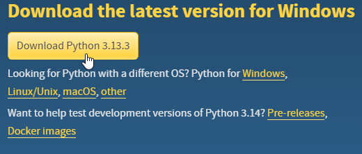
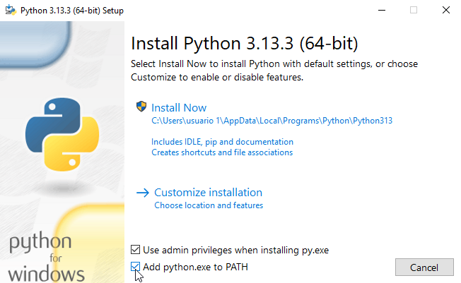

# INTRODUCCIÓN A PYTHON 🐍
1. [¿Qué es?](#qué-es)
2. [¿Para qué se usa?](#para-qué-se-usa)
3. [¿Por qué Python?](#por-qué-python)
4. [Como instalar Python](#como-instalar-python)
---

# ¿Qué es?
Python es un lenguaje de programación de alto nivel, interpretado, multiparadigma (soporta programación orientada a objetos, estructurada y funcional) y de propósito general. Fue creado por Guido van Rossum en 1991 como un proyecto personal durante las vacaciones de Navidad de 1989, inspirado en lenguajes como ABC y con un nombre que rinde homenaje al grupo de comedia británico Monty Python.
Desde entonces, Python ha evolucionado hasta convertirse en uno de los lenguajes más populares del mundo, gracias a su sencillez, legibilidad y amplia gama de aplicaciones, desde desarrollo web hasta inteligencia artificial.


## *Características Clave:*
✔ **Sintaxis Clara y Legible:** Python utiliza una estructura basada en indentación (sangrías) en lugar de llaves {}, lo que lo hace más limpio y fácil de entender. Por ejemplo:
```PYTHON
if edad >= 18:
    print("Mayor de edad")
else:
    print("Menor de edad")
```
Comparado con otros lenguajes como Java o C++, Python reduce la cantidad de código necesario para realizar las mismas tareas.
- Hola Mundo en Pyton
```PYTHON
print("Hello World")
```
- Hola Mundo en Java
```JAVA
public class main(){
    public static void main(String[] args){
        System.out.println("Hello World");
    }
}
```

✔ **Lenguaje Interpretado:** A diferencia de C++ o Java, Python no necesita ser compilado antes de ejecutarse. El intérprete de Python lee y ejecuta el código línea por línea, lo que permite:
- Desarrollo más rápido (sin tiempos de compilación).
- Mayor flexibilidad (puede ejecutarse en múltiples plataformas sin cambios).
- Modo interactivo (ideal para pruebas y aprendizaje).
  
✔ **Tipado Dinámico:** No es necesario declarar el tipo de una variable, Python lo infiere automáticamente:
```PYTHON
numero = 10          # Entero (int)
nombre = "Python"    # String (str)
es_activo = True     # Booleano (bool)
```
Esto facilita la escritura de código, aunque requiere más cuidado en el manejo de tipos.

✔ **Multiparadigma:** 
- Orientado a Objetos (POO): Permite crear clases y objetos.
- Programación Estructurada: Uso de funciones y módulos.
- Programación Funcional: Soporta funciones lambda, map, filter, etc.

✔ **Extensible y con Amplio Ecosistema:** Python puede integrarse con otros lenguajes como C, C++ o Java. Además, cuenta con un enorme repositorio de librerías (PyPI) que permiten expandir sus funcionalidades.

---

# ¿PARA QUÉ SE USA?
- 🌐 **Internet y Servicios Web:** Python es la columna vertebral de muchos servicios en línea que usamos a diario:
    - Motores de búsqueda: Google (partes de su infraestructura) y YouTube (antes de migrar parcialmente a Go).
  - Redes sociales: Instagram (backend en Django), Pinterest y Reddit.
  - Almacenamiento en la nube: Dropbox (lo usó en su backend por años) y AWS (herramientas de automatización).
  - APIs y microservicios: Gracias a frameworks como Flask y FastAPI.
  - 📌 Ejemplo: Cuando subes una foto a Instagram, Python ayuda a procesarla y almacenarla.
- 🛠️ **Herramientas de Desarrollo y DevOps:** Automatización de despliegues: Herramientas como Ansible y SaltStack están escritas en Python.
  - Testing y QA: Librerías como pytest y Selenium automatizan pruebas de software.
  - Integración continua: Plataformas como Jenkins usan scripts en Python para gestionar pipelines.
  - 📌 Dato clave: Muchos desarrolladores usan Python para escribir scripts que simplifican tareas repetitivas.
- 📊 **Ciencia de Datos e Inteligencia Artificial:** Python domina en análisis de datos, machine learning e IA:
  - Análisis de datos: Librerías como Pandas y NumPy son estándares en la industria.
  - Visualización: Matplotlib y Seaborn crean gráficos profesionales.
  - Machine Learning: TensorFlow (Google) y PyTorch (Meta) usan Python como interfaz principal.
  - Big Data: PySpark (de Apache Spark) procesa grandes volúmenes de datos.
  - 📌 Ejemplo: Netflix recomienda películas usando algoritmos escritos en Python.
- 🔬 **Investigación Científica y Académica:**
  - Simulaciones y cálculos complejos: Científicos reemplazaron herramientas como MATLAB por Python (con SciPy).
  - Bioinformática: Analiza secuencias de ADN con Biopython.
  - Física y astronomía: La NASA usa Python para procesar datos de telescopios.
  - 📌 Dato: El primer agujero negro fotografiado (2019) se analizó con Python.
- ⚙️ **Automatización y Scripting:**
  - Robótica: Raspberry Pi y robots educativos (como los de LEGO Mindstorms) se programan en Python.
  - Web scraping: Extraer datos de páginas web con BeautifulSoup o Scrapy.
  - Automatización de oficina: Librerías como openpyxl manipulan archivos de Excel.
  - 📌 Ejemplo: Periodistas usan Python para recolectar datos y generar visualizaciones.
- 🎮 **Desarrollo de Juegos y Gráficos:** Aunque no es el rey de los juegos AAA, Python tiene su espacio:
  - Prototipado rápido: Con Pygame o Panda3D.
  - Herramientas para game design: Autodesk Maya (animación 3D) integra Python para scripts.
  - 📌 Dato: Battlefield 2 usó Python para lógica de juego y menús.

---

# ¿POR QUÉ PYTHON?
Python se ha convertido en uno de los lenguajes de programación más populares del mundo, y no es por casualidad. Su diseño, filosofía y versatilidad lo hacen ideal para principiantes, profesionales y grandes empresas. A continuación, te explico las razones clave por las que deberías considerar Python como tu lenguaje de programación.
## 1. Es Fácil de Aprender y Enseñar
✅ Curva de aprendizaje rápida → Python tiene una sintaxis clara y cercana al lenguaje humano, lo que permite escribir código funcional en poco tiempo.
✅ Ideal para principiantes → No requiere conocimientos avanzados para empezar, a diferencia de lenguajes como C++ o Java.
✅ Perfecto para la enseñanza → Los profesores pueden enfocarse en conceptos fundamentales de programación en lugar de detalles técnicos complejos.
Ejemplo:
```PYTHON
if edad >= 18:
    print("Mayor de edad")
```
Comparado con otros lenguajes, Python evita símbolos innecesarios ({}, ;), haciendo el código más limpio.
## 2. Es Productivo y Eficiente
✅ Desarrollo más rápido → Permite escribir programas con menos líneas de código que Java, C++ o JavaScript.
✅ Menos errores → Al ser interpretado, detecta problemas en tiempo de ejecución sin necesidad de compilación previa.
✅ Gran legibilidad → El código de Python es fácil de entender, incluso si no lo escribiste tú.
Ejemplo:
```PYTHON
# Sumar elementos de una lista
suma = sum([1, 2, 3, 4, 5])
```
En otros lenguajes, esto requeriría bucles y más código.
## 3. Tiene una Gran Comunidad y Librerías
✅ Miles de bibliotecas gratuitas (PyPI) para casi cualquier necesidad.
✅ Soporte constante → Python tiene actualizaciones frecuentes y una comunidad activa.
✅ Documentación extensa → Ideal para resolver dudas rápidamente.
📌 Ejemplos de librerías útiles:
- requests → Para hacer peticiones HTTP.
- matplotlib → Para gráficos y visualización de datos.
- selenium → Para automatización web.
## 4. Es Gratuito, Abierto y Multiplataforma
✅ No hay que pagar licencias → Python es de código abierto (open source).
✅ Funciona en Windows, Linux y macOS sin cambios en el código.
✅ Fácil de instalar → Con herramientas como pip, instalar librerías es muy sencillo.
## 5. ¿Cuándo NO usar Python?
Aunque es muy versátil, Python no es la mejor opción en algunos casos:
❌ Programación de bajo nivel (drivers, sistemas embebidos).
❌ Aplicaciones móviles nativas (aunque hay opciones como Kivy, no es tan común como Swift o Kotlin).
❌ Procesos que requieren máximo rendimiento (Python es más lento que C++ o Rust).

---

# COMO INSTALAR PYTHON

Python es un lenguaje de programación **completamente gratuito y de código abierto**, lo que significa que:
- Puedes descargarlo e instalarlo sin costo alguno
- Tienes acceso al código fuente para modificarlo si deseas
- Es legal usarlo tanto para aprendizaje como en proyectos comerciales

Para trabajar con Python necesitas su **intérprete**, que es el programa que traduce y ejecuta tu código (La versión más reciente es la Python 3). La forma de instalar varia según el sistema operativo que estes usando.

## *LINUX*

Si usas un sistema operativo linux lo más probable es que ya tengas Python instalado, ya que la infraestructura de Python se usa de forma intensiva en muchos componentes de este sistema operativo.
Por ejemplo, algunas distribuciones pueden ensamblar herramientas específicas con el sistema y muchas de estas herramientas, como los administradores de paquetes, a menudo están escritas en Python. Algunas partes de los entornos gráficos disponibles en el mundo de Linux también pueden usar Python.

Para comprobar la instalación siendo un usuario de Linux abre la consola y escribe:
```
python3
```
Y si al presionar enter ves algo parecido a esto:
```
user@:~$ python3
Python 3.7.3 (default, Oct 31 2022, 14:04:00) 
[GCC 8.3.0] on linux
Type "help", "copyright", "credits" or "license" for more information.
```
Entonces no tienes que hacer nada más.
<br>

Si en caso contrario te marca un error, entonces instale Python desde el repositorio de su distribución de Linux. 
Ejemplo en Debian/Ubuntu:
```
sudo apt update
sudo apt install python3 python3-pip
```

Otra alternativa es visitar la [página oficial de descarga de Python](python.org/downloads) dar click en el texto de Linux remarcado, instalar el respectivo paquete de su distribución y seguir los pasos normales que corresponda. 

## *WINDOWS*
Para instalar Python en Windows primero debes visitar la [página oficial de descargar de Python](python.org/downloads) y descargar el instalador.



Una vez en el instalador marcar la opción **"Add Python to PATH"** y proseguir con la instalación tal y como indica.



Luego de finalizar comprobar la instalación en una consola o CMD
```
PS C:\Users\usuario 1> python --version
Python 3.12.6
```


