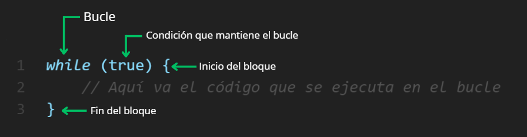
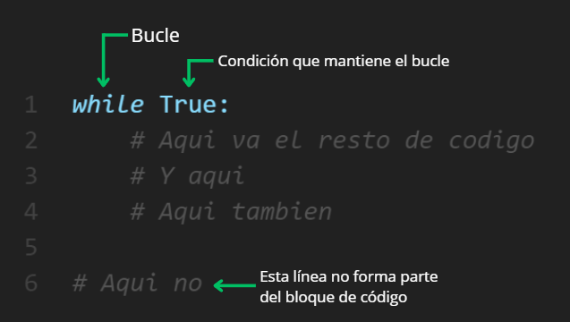

# LENGUAJES DE PROGRAMACIÓN, SINTAXIS Y PYTHON 🐍
- [LENGUAJES DE PROGRAMACIÓN, SINTAXIS Y PYTHON 🐍](#lenguajes-de-programación-sintaxis-y-python-)
- [INTRODUCCIÓN A LOS LENGUAJES DE PROGRAMACIÓN](#introducción-a-los-lenguajes-de-programación)
  - [Código Binario](#código-binario)
  - [Lenguajes de Programación](#lenguajes-de-programación)
- [LENGUAJE DE PROGRAMACIÓN PYTHON](#lenguaje-de-programación-python)
  - [Entornos de desarrollo Python](#entornos-de-desarrollo-python)
  - [Sintaxis de Python](#sintaxis-de-python)
- [DIFERENCIAS CON OTROS LENGUAJES](#diferencias-con-otros-lenguajes)
  - [Bloques de código](#bloques-de-código)
  - [Fin de una instrucción](#fin-de-una-instrucción)
  - [Declaración de variables](#declaración-de-variables)
---

# INTRODUCCIÓN A LOS LENGUAJES DE PROGRAMACIÓN
Antes de empezar con el Lenguaje de Programación Python consideramos que es importante detenernos para establecer *qué es un Lenguaje de Programación*.<br>

Pues, un lenguaje de programación es:
> Una serie detallada de Instrucciones que una computadora puede interpretar y realizar

Suena sencillo, pero la realidad es más complicada de lo que parece. El primer y principal problema que podemos encontrar es que la computadora solo entiende un tipo de lenguaje, uno sencillo pero que complica el traducir muchas instrucciones, o en su defecto Instrucciones complejas: El código binario

## Código Binario
El Binario es un sistema numérico que consta solo de dos simbolos el `0` y el `1`, cosa que lo diferencia del sistema numérico que acostumbramos a utilizar, el cúal es el decimal compuesto por 10 simbolos del `0` al `9`.<br>
Para entender mejor como se 'cuenta' en el sistema binario, tomemos como ejemplo el sistema decimal donde contamos del 1 al 9 y al llegar a este último colocamos el número 1 a la izquierda y seguimos contando y así sucesivamente (10, 11, 12, ... 19, 20, ...). Lo mismo sucede con el binario, donde se toma cada simbolo y al llegar al final se coloca el que sigue a la izquierda y vuelta a empezar. Por ejemplo 0, 1, 10, 11, 100, 101, 110, 111, 1000, 1001, ...

**Tabla comparativa entre decimal y binario:**

| Binario | Decimal |
| ------- | ------  |
| `0` | 0 |
| `1` | 1 |
| `10` | 2 |
| `11` | 3 |
| `100` | 4 |
| `101` | 5 |
| `1000` | 8 |
| `1111` | 15 |
| `10000` | 16 |
| `11111111` | 255 |
| `100000000` | 256 |

Como ya se mencionó, esto complica el realizar instrucciones ya que algo sencillo como "sumar 5 + 3" se traduce a 11000101 00000101 00000011

## Lenguajes de Programación
Dado que es prácticamente imposible para los humanos programar eficientemente en lenguaje máquina (binario puro), se desarrollaron sistemas intermediarios que permiten:

> "Escribir instrucciones en un formato comprensible para humanos y luego traducirlas automáticamente a código ejecutable por la computadora"

Estos sistemas son los lenguajes de programación, los cuales operan en distintos niveles de abstracción:

| Nivel | Ejemplo | Característica | Traducción a máquina |
| ---- | ------- | ---------------- | ------------------- |
| Alto nivel | Python, Java | Sintaxis cercana al lenguaje humano |  Requiere intérprete/compilador |
| Medio nivel | C, C++ | Balance entre abstracción y control de hardware | Compilado a lenguaje ensamblador |
| Bajo nivel | Ensamblador (ASM) | Instrucciones específicas del procesador | Ensamblador -> Código máquina |
| Máquina | Binario (0s y 1s) | único lenguaje que ejecuta directamente el CPU | Ejecución directa |

A su vez, los lenguajes de programación utilizan dos enfoques principales para convertir código fuente en instrucciones ejecutables por la computadora:

- ***Interpretado:***
    Los lenguajes interpretados van traduciendo el código a lenguaje máquina a tiempo real mientras ejecuta el programa. En un ejemplo humano sería como un interprete que traduce a alguien que habla otro idioma al mismo tiempo que este va hablando. <br>
    Ejemplo de lenguajes de programación interpretado:
    - Python
    - JavaScript
    - Ruby
- ***Compilado:***
    Los lenguajes compilados realizan una traducción completa del código a lenguaje máquina y dejan un ejecutable del programa. Siguiendo el ejemplo anterior, este sería un traductor que traduce completamente un documento o un libro y lo deja para que pueda ser leido cuantas veces quiera sin necesidad de traducir otra vez. <br>
    Cabe mencionar que, esto reduce la portabilidad del programa, pues la traducción a lenguaje máquina es diferente en cada computadora, por lo tanto el código debe ser compilado en cada máquina donde se quiera ejecutar (Aunque existen lenguajes compilados modernos que pueden generar binarios para múltiples plataformas sin recompilar en cada máquina, como por ejemplo Go), pero en cambio los programas se ejecutan más rápido porque ya fue traducido completamente, a diferencia de los interpretados. <br>
    Ejemplo de lenguajes compilados:
    - C
    - C++
    - Go
    - Rust

A continuación un cuadro que resume las características de cada uno:

| Característica | Lenguajes Interpretados | Lenguajes Compilados |
| -------------- | ----------------------- | -------------------- |
| Proceso de traducción | Traducción línea por línea durante la ejecución | Traducción completa antes de ejecutar |
| Velocidad de ejecución | Más lento | Más rápido |
| Portabilidad | Alto | Bajo |
| Manejo de errores | Detecta errores durante ejecución | Detecta errores en fase de compilación |
| Distribución | Código fuente visible | Binario ejecutable |

---

# LENGUAJE DE PROGRAMACIÓN PYTHON
Y llegamos hasta nuestro protagonista, *Python*. Tal como describimos anteriormente, este lenguaje se destaca por ser:
- De alto nivel: Con abstracciones que simplifican la programación
- Interpretado: No requiere compilación previa
- Multiparadigma: Soporta programación orientada a objetos, estructurada y funcional
- De propósito general: Útil en múltiples dominios (web, ciencia de datos, IA, etc.)

Sus principios de diseño, recogidos en The Zen of Python, enfatizan:
> "La legibilidad cuenta. [...] Lo explícito es mejor que lo implícito."

## Entornos de desarrollo Python
Un programa Python puede crearse en cualquier editor de texto básico (como Notepad o TextEdit), guardándose con extensión `.py`. Sin embargo, para desarrollo más especializado se recomienda usar:
1. **IDLE (Integrated Development and Learning Environment):**
   - Entorno básico incluido en la instalación estándar de Python
   - Ideal para principiantes
   - Ofrece:
     - Editor con resaltado de sintaxis
     - Consola interactiva
     - Depuración básica
2. **IDEs Avanzados:**

| Entorno | Ventajas | Ideal para |
| ------- | -------- | ---------- |
| VS Code | Ligero, extensible, multiplataforma | Desarrollo general |
| PyCharm | Herramientas profesionales integradas | Proyectos complejos |
| Jupyter | Enfoque interactivo/documentación | Análisis de datos |

3. Editores de Texto mejorados:
- Sublime Text
- Atom
- Vim

## Sintaxis de Python
Python se destaca por su sintaxis limpia y minimalista, diseñada para priorizar la legibilidad del código. Estas son sus características principales:

***Comentarios*** <br>
Los comentarios son parte del código que el interprete ignora y no ejecuta lo que se encuentra adentro. Estos son muy importante para hacer el código más legible y a ayudar a identificar de mejor manera cada bloque del código. En python, los comentarios empiezan con un hash o hashtag (#) 
```PYTHON
# Este es el primer comentario
# Otro comentario
# Python es un gran lenguaje
```
Y para hacer comentarios de varias líneas es con triple comilla
```PYTHON
'''Este es un comentario
de multiples
lineas'''
```

***Variables*** <br>
Las variables son datos que se guardan en la memoria del computador. Las variables hacen referencia a la dirección de la memoria donde está ubicado el dato que guarda. No se permiten números, caracteres especiales o guiones al inicio de los nombres de una variable. 
Una variable puede tener nombres cortos, como x, y, z, pero es recomendable usar nombres descriptivos: `primernombre`, `apellido`, `edad`, `pais`.

*Reglas para nombre variables en Python:* <br>
- Las variables no pueden tener espacios 
- Los nombres de las variables deben empezar con una letra o con un guion bajo
- Los nombres de las variables no pueden empezar con un numero
- Los nombres de las variables solo pueden tener letras, números y guiones bajos.
- Los nombres son case-sensitive, es decir, diferencia entre mayúsculas y minúsculas. (primer_nombre y Primer_nombre son dos variables diferentes)
- Los nombres de las variables se escriben usando la convención de snake case (snake_case) que consta de usar un guion bajo en lugar de espacios.

Algunos ejemplos de nombres validos
```
firstname
lastname
age
country
city
first_name
last_name
capital_city
year_2021
year2021
current_year_2021
birth_year
num1
num2
```
Algunos ejemplos de nombre inválidos
```
first-name
first@name
first$name
num-1
1num
```

***Convención de nombres*** <br>
Una convención es una practica que siguen todos los programadores para hacer más fácil el entender un código de Python sin importar el área que trabajemos o el país de donde vengamos. Es básicamente un estándar

| Nombre convención | Ejemplo | Uso común |
| ----------------- | ------- | --------- |
| camelCase | fechaDeNacimiento | Se usa para declarar variables |
| snake_case | fecha_de_nacimiento | Se usa para declarar variables |
| SCREAMING_SNAKE_CASE | FECHA_DE_NACIMIENTO | Se usa para constantes |
| kebab-case | fecha-de-nacimiento | Se usa para URL |

***Indentación Obligatoria:*** <br>
Python utiliza sangrías (espacios o tabs) para definir bloques de código
```PYTHON
# Python
if 5 > 2:
    print("Cinco en mayor")
    
print("Esto ya no forma parte del if")
```

---

# DIFERENCIAS CON OTROS LENGUAJES
Como ya se mencionó, Python se destaca por su sintaxis concisa, legible y minimalista. Para comprender mejor esta ventaja, comparemos su estructura con otros lenguajes populares derivados de C (como Java, JavaScript o C++), que comparten ciertas características fundamentales:
## Bloques de código
En lenguajes derivados de C, los bloques se definen con llaves `{}`:


En Python los bloques de código se definen mediante indentación (sangría):


## Fin de una instrucción
En lenguajes derivados de C, el final de una instrucción se marca con punto y coma `;`
```C
// C
int x = 5;
printf(x);
```
Este forma explicita de marcar el final de una instrucción permite flexibilidad, como el escribir más de una instrucción en una misma línea
```C
// C
int x=5; printf("%d", x);
```
O el permitir independencia en el formato al ignorar los espacios o saltos de línea
```C
// C
int x
=
5; // Código valido y funcional
```
Mientras que, en Python el fin de una instrucción se marca con el salto de línea
```Python
# Python
x = 5
print(x)
```
Esto debido a la filosofía de Python el cuál le da más valor a la legibilidad y por lo tanto usa la identación y saltos de línea como parte de su gramática. Aunque, existen algunas excepciones como el uso de parentesis que permiten mantener la misma instrucción en multiples líneas.
```PYTHON
# Python
resultado = (valor1 + 
            valor2)
```
## Declaración de variables
Esto forma parte de las diferencias entre los distintos tipos de Lenguajes de Programación. Pero, para hacer un ejemplo sobre la diferencia entre las sintaxis:<br>
Los lenguajes de tipado *estático* como Java requieren que se especifique el *tipo* de la varibale al ser delcarado
```JAVA
// Java
String nombre = "Java"; // Se declara como texto
int edad = 30; // Se declara como número entero
```
Python, por otro lado, es de tipado *dinámico* lo que significa que infiere el tipo de dato de manera automática
```PYTHON
# Python
nombre = "python"
edad = 30
```