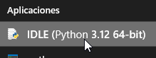
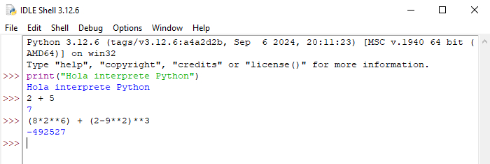
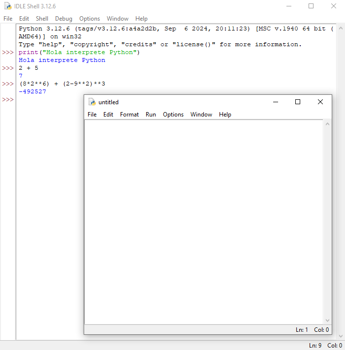
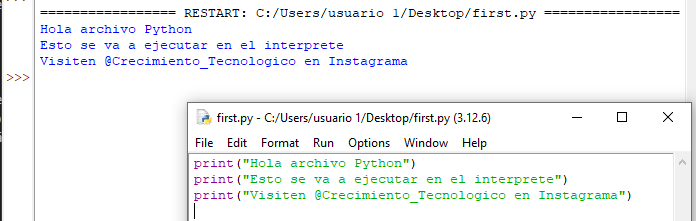
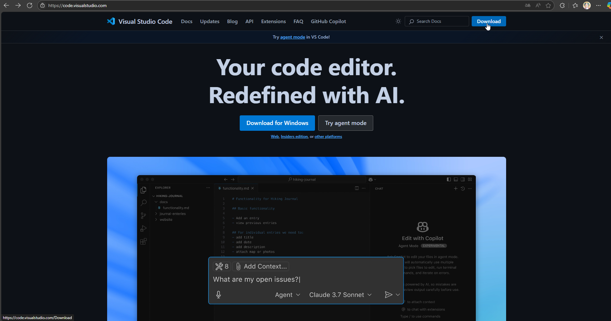
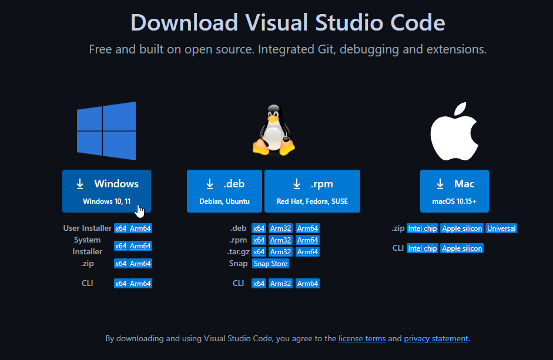
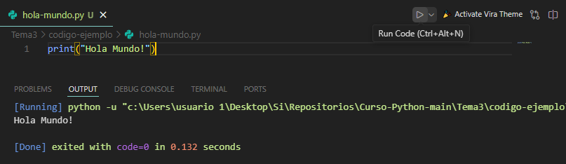

<div style="text-align: center;">

[◄ Tema anterior: Lenguajes de programación, sintaxis y python](../Tema2/) 

</div>

---

# EL PRIMER PROGAMA EN PYTHON üêç
1. [ESCRIBIENDO EL PRIMER PROGRAMA](#escribiendo-el-primer-programa)
2. [INICIANDO EN VISUAL STUDIO CODE](#iniciando-en-visual-studio-code)
   - 2.1 [Instalación de Visual Studio Code](#instalación-de-visual-studio-code)
3. [EL PRIMER HOLA MUNDO](#el-primer-hola-mundo)
4. [¿QUÉ SE PUEDE HACER AHORA?](#qué-se-puede-hacer-ahora)

---

# ESCRIBIENDO EL PRIMER PROGRAMA
Como ya se mencionó en la sección anterior, la instalación básica de Python cuenta con: 
- **El interprete de Python**
  - Se puede ejecutar en cualquier terminal y entorno especializado 
- **IDLE (Integrated Development and Learning Environment):**
   - Ofrece:
     - Editor con resaltado de sintaxis
     - Consola interactiva
     - Depuración básica

Este ultimo se puede utilizar para escribir código o probar el interprete. Solo tienes que ejecutarlo 



Y te encontraras con la siguiente ventana


Este es el interprete de Python y puedes ejecutar código en este:



Como se puede apreciar, al escribir algo y darle enter automáticamente interpreta la línea e imprime el resultado. 
Este interprete también se puede ejecutar desde una terminal escribiendo Python (o Python3 en Linux)


Si se quiere escribir más código entonces te tienes que dirigir a `File -> New File` y abrirá una ventana adicional que funciona como un editor de texto especializado para escribir código Python



En este mismo se puede escribir varias líneas de código y luego se ejecutar en el interprete. Por ejemplo escribir 

```PYTHON
print("Hola archivo Python")
print("Esto se va a ejecutar en el interprete")
print("Visiten @Crecimiento_Tecnologico en Instagrama")
```

Darle a `File -> Save As` para guardar el archivo y luego a `Run -> Run Module` para ejecutarlo



---

# INICIANDO EN VISUAL STUDIO CODE
Aunque el IDLE de Python es un entorno más que suficiente para escribir y ejecutar código, no es lo que se acostumbra en entornos más especializados. Si no que, se opta por otros IDEs como **Visual Studio Code** o **PyCharm** los cuales fueron mencionados en el tema anterior. En este curso se usará *Visual Studio Code* pero eres libre de utilizar el que prefieras.

## Instalación de Visual Studio Code
Para instalar este entorno tienes que acceder a la [pagina web oficial](https://code.visualstudio.com/) de VS Code y darle a `descargar` o `download`

 
 Y seleccionar el Sistema Operativo que utilizas

 

 Y continua el proceso de instalación según tu Sistema Operativo y sigue las intrucciones que te indica el instalador. 
 Al finalizar deberías poder ejecutar VS Code y ver el entorno
 
 

Muy seguramente lo que te encuentras se va a ver diferente a la imágen anterior. Esto se debe a que VS Code es un entorno completamente personalizable, donde a través de extensiones puedes agregar funcionalidades que te ayuda a escribir código, realizar implementaciones con herramientas externas como Git o Docker o incluso cambiar el estilo visual de este. 
Te invitamos a que explores las distintas configuraciones y extensiones que ofrece este entorno para que puedas crear tu entorno personalizado.

---

# EL PRIMER HOLA MUNDO
Entre programadores existe la costumbre de que al momento de empezar a programar o al aprender una nueva tecnología lo primero que se hace es escribir `'Hola Mundo'`. Esta tradición se atribuye a un programa de ejemplo del libro *El lenguaje de programación C* de 1978


Así que vamos a hacer lo propio, en nuestro entorno le damos click a `open folder` y seleccionamos una carpeta o creamos una donde vamos a guardar nuestros códigos. Una vez el VS Code inicie con el archivo tendremos la ventana de `explorer` y al pasar con el raton se nos mostrará las opciones para `crear archivo` o `para crear carpeta`


Seleccionamos `nuevo archivo` o `new file` y lo nombramos `hola-mundo.py`. La extensión `.py` es muy importante porque es lo que permite reconocerlo como archivo de Python y por lo tanto el compilarlo. Cada lenguaje tiene su propia extensión.


Escribimos `print("Hola Mundo!")` guardamos y le damos al boton de `Run Code` o presiona `F5` en el teclado



---

# ¿QUÉ SE PUEDE HACER AHORA?
Ahora que puedes ejecutar código Python puedes probar todo lo mostrado en el [tema anterior](../Tema2/) y además empezar a probar las funciones integradas de python, los cuáles son funciones preestablecidas que realizan una acción, como por ejemplo `print()` que imprime un valor en consola. Algunas de estas funciones son:

- ***Funciones de manipulación de secuencias:***
  - **len()**: Devuelve la longitud de una secuencia (lista, tupla, cadena, etc.).
  - **max()**: Devuelve el elemento m√°ximo de una secuencia.
  -  **min()**: Devuelve el elemento mínimo de una secuencia.
  -  **sorted()**: Devuelve una lista ordenada de los elementos de una secuencia.
- ***Funciones de entrada/salida:***
  -  **print()**: Imprime un mensaje en la salida est√°ndar (normalmente la consola).
  -  **input()**: Lee una entrada del usuario desde la entrada est√°ndar (normalmente la consola).
- ***Funciones matemáticas y aritméticas:***
  -  **abs()**: Devuelve el valor absoluto de un n√∫mero.
  -  **round()**: Redondea un n√∫mero al entero m√°s cercano o al n√∫mero de decimales especificado.
  -  **sum()**: Devuelve la suma de todos los elementos de una secuencia.
  -  **pow()**: Devuelve el resultado de elevar un n√∫mero a una potencia.
- ***Funciones de gestión de excepciones:***
  -  **try**: Define un bloque de código para probar posibles excepciones.
  -  **except**: Define un bloque de código a ejecutar en caso de que ocurra una excepción en el bloque try.
  -  **finally**: Define un bloque de código que se ejecutará sin importar si ocurre o no una excepción.
- ***Otras funciones √∫tiles:***
  -  **help()**: Muestra la documentación de ayuda para un objeto, módulo o función.
  -  **dir()**: Devuelve una lista de los atributos y métodos de un objeto.
  -  **id()**: Devuelve el identificador √∫nico de un objeto.

---

<div style="text-align: center;">

[◄ Tema anterior: Lenguajes de programación, sintaxis y python](../Tema2/) | [Siguiente tema: Programando en Python ►](../Tema4/)

</div>