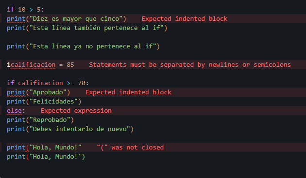
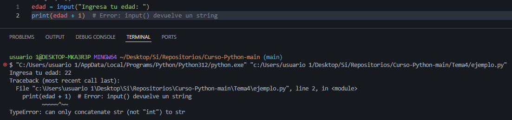

<div style="text-align: center;">

[◄ Tema anterior: EL PRIMER PROGAMA EN PYTHON](../Tema3/) 

</div>

---

# ERRORES EN PYTHON 🐍
1. [COMO IDENTIFICAR ERRORES](#como-identificar-errores)
  - [1.1 ERRORES DE SINTAXIS](#11-errores-de-sintaxis)
  - [1.2 ERRORES EN TIEMPO DE EJECUCIÓN](#12-errores-en-tiempo-de-ejecución)
  - [1.3 ERRORES LÓGICOS](#13-errores-lógicos)
  - [1.4 ERRORES CONTROLADOS](#14-errores-controlados)
    - [1.4.1 Método 1: Validación mediante lógica](#método-1-validación-mediante-lógica)
    - [1.4.2 Método 2: Bloques `try-except`](#método-2-bloques-try-except)

---

# COMO IDENTIFICAR ERRORES
Si probaste las funciones integradas del [Tema 3](../Tema3/) por tu cuenta, es probable que hayas encontrado algunos mensajes de error. No te preocupes si es tu caso, pues en el día a día del programador los mensajes de error son comunes y hasta una herramienta más que te ayuda a la hora de desarrollar.

*Los errores se clasifican en cuatro categorías principales:*

## 1.1 ERRORES DE SINTAXIS
Como ya se mencionó anteriormente, los lenguajes de programación tienen una sintaxis con reglas que se deben respetar para que el intérprete pueda ejecutar el programa correctamente. Estos errores normalmente se identifican en editores avanzados porque están preparados para detectarlos y marcarlos para su corrección.



Este tipo de errores sucede comúnmente por: 
- No cerrar un paréntesis `()`
- Olvidar `:` en estructuras como `if`, `for`, `def`
- Mezclar comillas simples (`'`) y dobles (`"`)
- Indentación incorrecta (espacios/tabuladores inconsistentes)

## 1.2 ERRORES EN TIEMPO DE EJECUCIÓN
Estos errores ocurren cuando la sintaxis es correcta, pero una operación no puede realizarse durante la ejecución del programa. Se muestran en la consola cuando ocurren.



En este caso, el error `TypeError: can only concatenate str (not "int") to str` indica que los valores tipo `string` solo pueden concatenarse con otros `string`. Es decir, una operación entre un texto (`str`) y un número entero (`int`) no es válida y produce un error.

El mensaje de error se compone de:
1. Traceback: La ruta que sigue el código a través del programa.
2. Ubicación del error:
   - Archivo que contiene el error
   - Número de línea
   - Nombre del módulo
3. Contenido de la línea errónea.
4. Tipo de error y explicación breve.

> Nota: El número de línea puede ser engañoso, ya que Python muestra donde detectó los efectos del error, no necesariamente su origen exacto. Se recomienda revisar las líneas anteriores.

## 1.3 ERRORES LÓGICOS
Ocurren cuando el código se ejecuta completamente sin errores aparentes, pero no produce el resultado esperado.

Ejemplo con `round()`:
```PYTHON
precio = 99.987  
print(f"Total: ${round(precio)}")  # Muestra $100 (redondeo no deseado)  
```
Solución: Especificar decimales:
```PYTHON
print(f"Total: ${round(precio, 2)}")  # Muestra $99.99  
```

## 1.4 ERRORES CONTROLADOS
En los sistemas que desarrollamos, es normal que los usuarios realicen acciones o ingresen valores inválidos para el flujo del programa. También pueden ocurrir fallos en procesos externos de los que dependemos.

Debemos considerar que:
- Al llamar a procesos externos (otros programas, bases de datos o APIs), su resultado afecta nuestro programa porque comparten el mismo hilo de ejecución.
- Un programa bien diseñado no debería detenerse completamente ante errores o comportamientos inesperados.

Aunque ningún sistema es infalible, podemos implementar métodos para manejar estos casos:

### Método 1: Validación mediante lógica

```PYTHON
# Ejemplo de menú para el juego del ahorcado
print("\nJUEGO DEL AHORCADO\n@Crecimiento_Tecnologico")
print("\nSu racha es de:", winStreak, "\n\nElija una opción:\n1. Jugar\n2. Explicación\n3. Salir")
seleccion = input("> ").upper()  # Convertimos a mayúsculas aquí

if seleccion in ('1', 'JUGAR'):
    winStreak = jugar(winStreak)
elif seleccion in ('2', 'EXPLICACIÓN'):  # (corregido acento)
    print(explicacion)
    input()
elif seleccion in ('3', 'SALIR'):
    print("\nSaliendo del programa")
    break
else:
    print("\nPor favor, seleccione una opción válida")  # (acento)
```

En este ejemplo se puede ver un menu en consola para un juego del ahorcado, por cada opción mostrada hay una condición que llama a una función del código, de esta manera el usuario puede interactuar con el programa y elegir que hacer dentro de las opciones que le muestran. Sin embargo, hay una condición extra el cual está para cuando *el usuario ingresa una opción diferente a las que espera el programa*, aunque esto no genera un error en ejecución si puede hacer que el programa se salga de su comportamiento esperado, es por eso que estas validaciones son importantes.

### Método 2: Bloques `try-except`

En los bloques `try` y `except` se coloca el código que se quiere *intentar* ejecutar y si sucede un error de ejecución lo *atrapa* y lo muestra como una *excepción* sin que el programa deje de ejecutarse. Estos bloques son usados mayormente cuando se va a ejecutar procesos externos donde no tenemos certeza si va a funcionar o no.

- **Ejemplo 1: Conexión a base de datos**

```PYTHON
def db_disponible():
    try:
        conn = psycopg2.connect(
            host=os.getenv("DB_HOST", "localhost"),
            port=os.getenv("DB_PORT", "5432"),
            database=os.getenv("DB_NAME", "finanzas"),
            user=os.getenv("DB_USER", "root"),
            password=os.getenv("DB_PASSWORD", "1234")
        )
        conn.close()
        return True
    except Exception as e:  # Captura cualquier error
        logging.error(f"La base de datos no está disponible: {e}")
        return False
```

- **Ejemplo 2: Consumo de API**

```PYTHON
try:
    url = "https://dragonball-api.com/api/characters/1"
    logging.info("Consultando API")
    response = requests.get(url)
    response.raise_for_status()  # Lanza error si la petición falla
    return response.json()
except Exception as err:
    logging.error(f"Error al consultar la API: {err}")
    return None
```

> Nota para principiantes: Estos ejemplos utilizan conceptos avanzados que se explicarán más adelante. Por ahora, enfócate en manejar errores mediante lógica y evita usar try-except hasta que dominemos los fundamentos.

Ahora, para practicar puedas tratar de resolver el [código que dejamos en la carpeta codigo](./codigo/ejercicio.py) antes de avanzar a la siguiente sección.

---

<div style="text-align: center;">

[◄ Tema anterior: El primer prgrama en Python](../Tema2/) | [Siguiente tema: Programando en Python ►](../Tema4/)

</div>